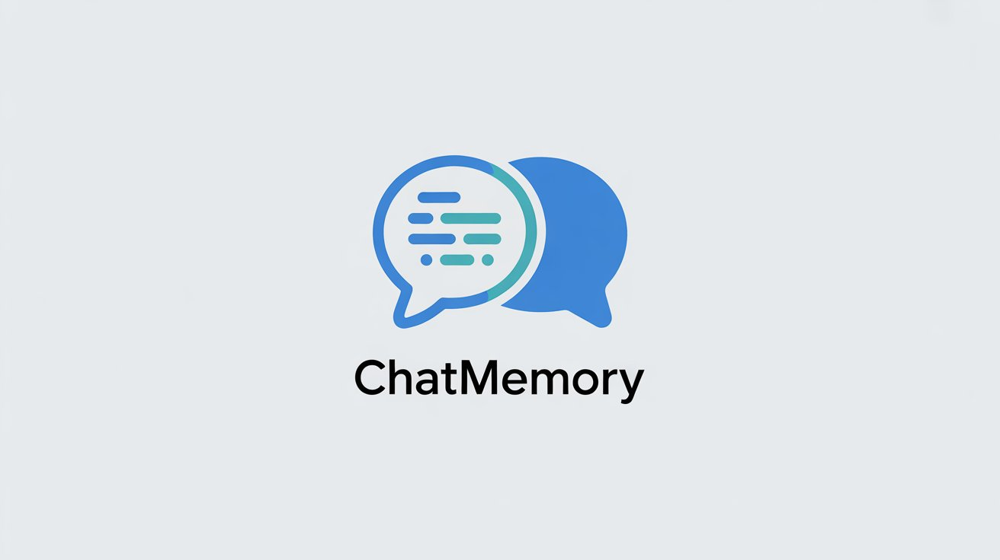
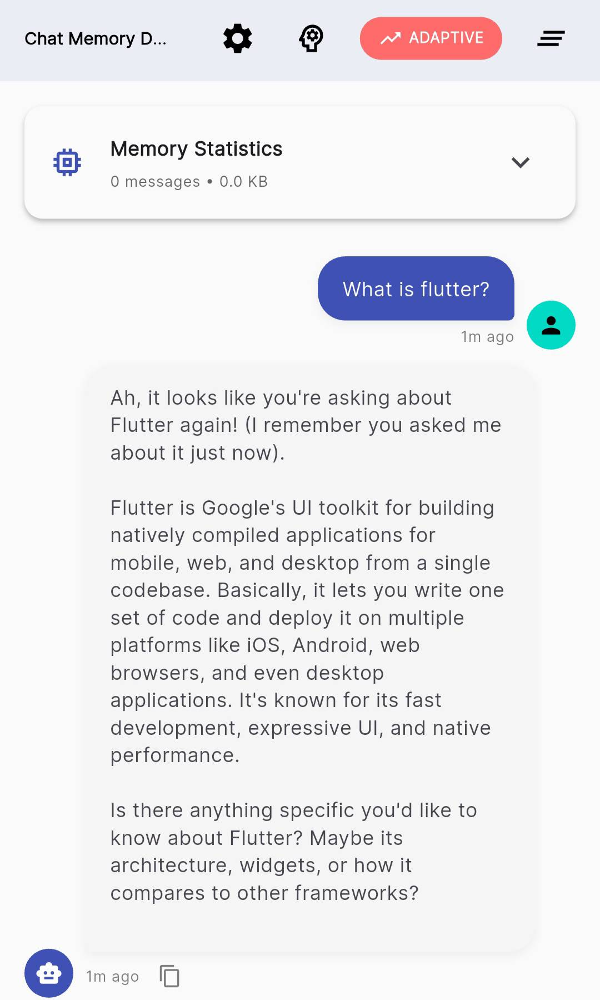
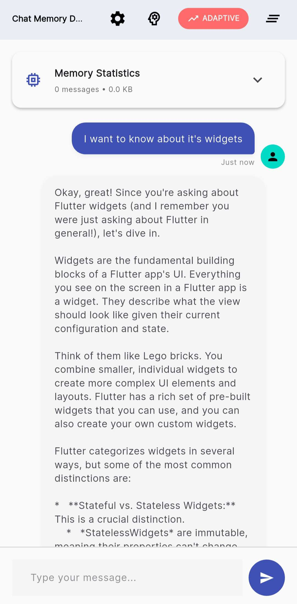
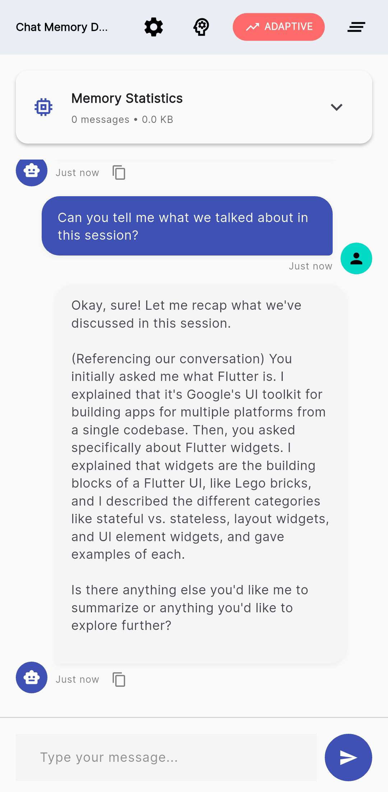

# Chat Memory - Intelligent Conversation Memory

<p align="center">
  
</p>

A powerful Dart package that provides **intelligent memory management** for conversational AI applications with **automatic system prompts**, **semantic retrieval**, and **hybrid memory architecture**.

[](https://pub.dev/packages/chat_memory)
[](https://github.com/Liv-Coder/chat_memory/actions)
[](https://pub.dev/packages/chat_memory)

## Screenshot's

<p align="center">
  <a href="screenshots/screenshot_1.jpg"></a>
  <a href="screenshots/screenshot_2.jpg"></a>
  <a href="screenshots/screenshot_3.jpg"></a>
</p>

## 🚀 Quick Start

```dart
import 'package:chat_memory/chat_memory.dart';

// Simple usage with automatic system prompt
final chatMemory = await ChatMemory.development();
await chatMemory.addMessage('Hello!', role: 'user');
final context = await chatMemory.getContext();
print(context.promptText); // Includes friendly assistant system prompt

// Custom configuration with system prompt
final chatMemory = await ChatMemoryBuilder()
  .production()
  .withSystemPrompt('You are a helpful financial advisor.')
  .withMaxTokens(4000)
  .build();
```

## ✨ Key Features

### 🤖 **Automatic System Prompts**

- **Default Friendly Behavior**: Automatic friendly assistant prompts
- **Custom System Prompts**: Easy configuration for specialized AI personalities
- **Domain-Specific Templates**: Pre-built prompts for medical, legal, educational use cases
- **Persistent Across Sessions**: System prompts maintained through conversation clearing

### 🧠 **Simplified API with Powerful Memory**

- **One-Line Setup**: `ChatMemory.development()` for instant intelligent memory
- **Declarative Methods**: Simple `addMessage()` and `getContext()` API
- **Smart Presets**: Development, production, and minimal configurations
- **Builder Pattern**: Fluent configuration for advanced customization

### 🏭 **Advanced Memory Features**

- **Hybrid Architecture**: Short-term + long-term + semantic memory layers
- **Automatic Summarization**: Intelligent compression of older conversations
- **Semantic Retrieval**: Vector-based search for relevant historical context
- **Token Management**: Smart optimization within LLM token limits
- **Persistent Storage**: Optional SQLite-based conversation persistence

### 🔧 **Processing Pipeline**

- **Intelligent Chunking**: Multiple strategies for message segmentation
- **Embedding Pipeline**: Resilient text-to-vector conversion with retry logic
- **Memory Workflows**: Automated cleanup and optimization
- **Performance Monitoring**: Comprehensive analytics and health checks

## 📋 Table of Contents

- [Installation](#installation)
- [Basic Usage](#basic-usage)
- [System Prompts](#system-prompts)
- [Configuration](#configuration)
- [Advanced Features](#advanced-features)
- [Migration Guide](#migration-guide)
- [Examples](#examples)
- [API Reference](#api-reference)

## 📦 Installation

```yaml
dependencies:
  chat_memory: ^1.0.0
```

```bash
flutter pub get
```

## 📋 Basic Usage

### Simple Setup

```dart
import 'package:chat_memory/chat_memory.dart';

// Quick setup with sensible defaults
final chatMemory = await ChatMemory.development();

// Add messages
await chatMemory.addMessage('What is machine learning?', role: 'user');
await chatMemory.addMessage('Machine learning is...', role: 'assistant');

// Get context for next AI prompt
final context = await chatMemory.getContext();
print('Prompt: ${context.promptText}');
print('Token count: ${context.estimatedTokens}');
```

### Smart Presets

```dart
// Development: Fast in-memory setup
final devMemory = await ChatMemory.development();

// Production: Persistent storage + optimization
final prodMemory = await ChatMemory.production();

// Minimal: Basic functionality only
final minimalMemory = await ChatMemory.minimal();
```

## 🤖 System Prompts

### Default Behavior

All ChatMemory instances automatically include a friendly assistant system prompt:

```dart
final chatMemory = await ChatMemory.development();
// Automatically includes: "You are a friendly and helpful assistant..."
```

### Custom System Prompts

```dart
// Custom assistant personality
final chatMemory = await ChatMemoryBuilder()
  .development()
  .withSystemPrompt('You are a supportive financial coach.')
  .build();

// Domain-specific prompts
final medicalPrompt = SystemPromptManager.getPromptForDomain('medical');
final chatMemory = await ChatMemoryBuilder()
  .production()
  .withSystemPrompt(medicalPrompt)
  .build();

// Disable system prompts
final chatMemory = await ChatMemoryBuilder()
  .minimal()
  .withoutSystemPrompt()
  .build();
```

### Runtime System Prompt Management

```dart
// Update system prompt during conversation
await chatMemory.updateSystemPrompt('You are now a creative writing assistant.');

// Check current system prompt
final currentPrompt = await chatMemory.getSystemPrompt();
print('Current prompt: $currentPrompt');

// Check if system prompt is active
if (chatMemory.hasSystemPrompt()) {
  print('System prompt is active');
}
```

## ⚙️ Configuration

### Builder Pattern

```dart
final chatMemory = await ChatMemoryBuilder()
  // Choose base configuration
  .production()

  // Configure system prompt
  .withSystemPrompt('You are a helpful coding assistant.')

  // Set token limits
  .withMaxTokens(8000)

  // Configure memory features
  .withSemanticMemory(enabled: true)
  .withSummarization(enabled: true)

  // Set up persistence
  .withPersistence(enabled: true, databasePath: '/custom/path')

  // Build the instance
  .build();
```

### Preset Comparison

| Feature         | Development | Production | Minimal     |
| --------------- | ----------- | ---------- | ----------- |
| System Prompts  | ✅ Default  | ✅ Default | ❌ Disabled |
| Storage         | In-Memory   | SQLite     | In-Memory   |
| Max Tokens      | 2,000       | 8,000      | 1,000       |
| Semantic Memory | ✅          | ✅         | ❌          |
| Summarization   | ✅          | ✅         | ❌          |
| Logging         | Verbose     | Optimized  | Minimal     |

## 🚀 Advanced Features

### Memory Statistics

```dart
final stats = await chatMemory.getStats();
print('Messages: ${stats['messageCount']}');
print('System prompts: ${stats['systemMessages']}');
print('Memory enabled: ${stats['hasMemory']}');
```

### Conversation Management

```dart
// Clear conversation (system prompt preserved)
await chatMemory.clear();

// Check initialization status
if (chatMemory.isInitialized) {
  print('Ready to use!');
}

// Access configuration
final config = chatMemory.config;
print('Max tokens: ${config.maxTokens}');
print('System prompt enabled: ${config.useSystemPrompt}');
```

### Advanced Memory Access

```dart
// Access underlying conversation manager for advanced features
final manager = chatMemory.conversationManager;

// Advanced context building
final enhancedPrompt = await manager.buildEnhancedPrompt(
  clientTokenBudget: 4000,
  userQuery: 'Tell me about our previous discussion',
);

// Semantic search
final semanticResults = enhancedPrompt.semanticMessages;
print('Found ${semanticResults.length} relevant memories');
```

## 📝 Migration Guide

### From v1.0.0 to Current

The new ChatMemory facade provides a simplified API while maintaining all functionality:

```dart
// Old way (still works)
final manager = await EnhancedConversationManager.create(
  preset: MemoryPreset.production,
  maxTokens: 8000,
);
await manager.appendSystemMessage('You are a helpful assistant.');
await manager.appendUserMessage('Hello');
final prompt = await manager.buildPrompt(clientTokenBudget: 4000);

// New way (recommended)
final chatMemory = await ChatMemoryBuilder()
  .production()
  .withSystemPrompt('You are a helpful assistant.')
  .withMaxTokens(8000)
  .build();
await chatMemory.addMessage('Hello', role: 'user');
final context = await chatMemory.getContext();
```

### Benefits of Migration

- **Simpler API**: Fewer concepts to learn
- **Automatic System Prompts**: No manual system message management
- **Better Defaults**: Optimized configurations out of the box
- **Declarative Configuration**: Clear, readable setup code

## 📚 Examples

### Personal Assistant

```dart
final assistant = await ChatMemoryBuilder()
  .production()
  .withSystemPrompt(
    'You are a personal assistant. Remember the user\'s preferences, '
    'schedule, and past conversations to provide personalized help.',
  )
  .withMaxTokens(6000)
  .build();

await assistant.addMessage('Schedule a meeting for tomorrow at 2 PM', role: 'user');
final context = await assistant.getContext();
```

### Educational Tutor

```dart
final tutor = await ChatMemoryBuilder()
  .development()
  .withSystemPrompt(SystemPromptManager.getPromptForDomain('educational'))
  .build();

await tutor.addMessage('Explain quantum physics simply', role: 'user');
final context = await tutor.getContext();
```

### Creative Writing

```dart
final writer = await ChatMemoryBuilder()
  .production()
  .withSystemPrompt(
    'You are a creative writing assistant. Help develop stories, '
    'characters, and plots. Remember previous story elements.',
  )
  .withSemanticMemory(enabled: true) // Important for story continuity
  .build();
```

## 📋 API Reference

### Core Classes

- **`ChatMemory`**: Main facade for simplified memory management
- **`ChatMemoryBuilder`**: Fluent configuration builder
- **`ChatMemoryConfig`**: Configuration container with system prompt options
- **`SystemPromptManager`**: Utility for advanced system prompt management
- **`ChatContext`**: Context result with prompt text and metadata

### Quick Reference

```dart
// Setup
final chatMemory = await ChatMemory.development();
final chatMemory = await ChatMemoryBuilder().production().build();

// Messages
await chatMemory.addMessage(content, role: 'user'|'assistant'|'system');

// Context
final context = await chatMemory.getContext(query: 'optional');

// System Prompts
await chatMemory.updateSystemPrompt(prompt);
final prompt = await chatMemory.getSystemPrompt();
final hasPrompt = chatMemory.hasSystemPrompt();

// Management
await chatMemory.clear();
final stats = await chatMemory.getStats();
final config = chatMemory.config;
```

## 🌅 What's New

### Recent Improvements

- **✨ Simplified API**: New ChatMemory facade for easier integration
- **🤖 Automatic System Prompts**: Default friendly behavior with customization options
- **🏭 Builder Pattern**: Fluent configuration for complex setups
- **📋 Smart Presets**: Optimized configurations for different use cases
- **🔧 Enhanced Processing**: Improved chunking, embedding, and workflow systems

### Backward Compatibility

All existing APIs continue to work. The new ChatMemory facade provides a modern alternative while the original EnhancedConversationManager remains fully supported.

## 🔗 Links

- **[Example App](example/)**: Complete Flutter app demonstrating all features
- **[API Documentation](https://pub.dev/documentation/chat_memory/latest/)**
- **[GitHub Repository](https://github.com/Liv-Coder/chat_memory)**
- **[Issue Tracker](https://github.com/Liv-Coder/chat_memory/issues)**

## 🤝 Contributing

Contributions are welcome! Please feel free to submit issues, feature requests, and pull requests.

## 📜 License

This project is licensed under the MIT License - see the [LICENSE](LICENSE) file for details.

---

**Built with ❤️ for intelligent conversational AI**

_Empowering developers to create AI applications with sophisticated memory management and natural conversation flow._
